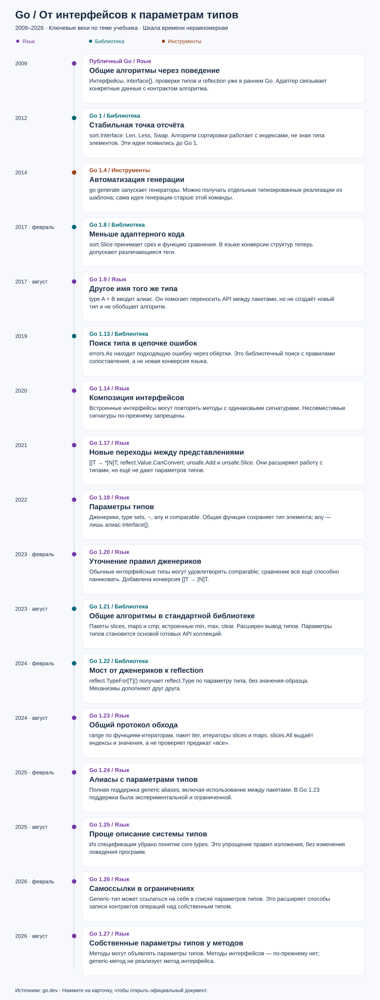

# 2. История возможностей

Код главы: [example_test.go](../../lessons/reference/modern/example_test.go) · [method_go127_test.go](../../lessons/reference/modern/method_go127_test.go).

> Цель главы: Связать изменения системы типов с версиями Go.

Эта хронология нужна как карта совместимости. Читайте её вместе с конкретными примерами, а не как список механизмов, которые сменяли друг друга: большинство продолжает сосуществовать.

## Таймлайн: как расширялись способы обобщения

[Открыть или сохранить таймлайн в SVG](../../book/assets/go-timeline.svg). На схеме показаны ключевые вехи по теме учебника, а не все изменения каждого релиза. Расстояния между событиями условные. Цвет отмечает основной акцент: язык, стандартную библиотеку или инструменты. Карточки ведут к официальным источникам; даты релизов можно сверить в [истории выпусков Go](https://go.dev/doc/devel/release).

Путь удобно читать так: сначала общий алгоритм выражали через операции интерфейса, функции-замыкания или reflection. Генерация позволяла получать несколько типизированных реализаций. Параметры типов дали способ описать одну функцию с сохранением связей между типами. Затем стандартная библиотека получила общие алгоритмы над коллекциями и единый протокол итерации.

Это развитие средств выражения, а не отмена старых подходов: адаптер нужен там, где данные следует связать с контрактом; reflection — там, где тип исследуется во время выполнения. Дженерики сами по себе не определяют, как правильно складывать деньги или сравнивать дроби.

## Подробная карта совместимости

| Этап | Изменение, относящееся к теме |
|---|---|
| Ранний Go → Go 1, 2012 | Базовая модель: явные конверсии, нетипизированные константы, интерфейсы, assertions, type switch, reflection, `unsafe` |
| [Go 1.8, 2017](https://go.dev/doc/go1.8#language) | При конверсии структур различия тегов перестали мешать |
| [Go 1.9, 2017](https://go.dev/doc/go1.9#language) | Пользовательские алиасы `type A = B` |
| [Go 1.13, 2019](https://go.dev/doc/go1.13) | `errors.As`: поиск ошибки нужного типа через обёртки |
| [Go 1.14, 2020](https://go.dev/doc/go1.14#language) | Встроенные интерфейсы могут иметь совпадающие методы с одинаковыми сигнатурами |
| [Go 1.17, 2021](https://go.dev/doc/go1.17#language) | `[]T → *[N]T`; `unsafe.Add`, `unsafe.Slice`; `reflect.Value.CanConvert` |
| [Go 1.18, 2022](https://go.dev/doc/go1.18#language) | Параметры типов, type sets, `~`, объединения типов, `any`, `comparable` |
| [Go 1.20, 2023](https://go.dev/doc/go1.20#language) | `[]T → [N]T`; расширение удовлетворения `comparable`; `unsafe.String`, `StringData`, `SliceData` |
| [Go 1.21, 2023](https://go.dev/doc/go1.21#language) | Расширен вывод аргументов типов, в том числе для функций и методов при проверке интерфейсов |
| [Go 1.22, 2024](https://go.dev/doc/go1.22) | `reflect.TypeFor[T]()` для получения типа без значения |
| [Go 1.23, 2024](https://go.dev/doc/go1.23#language) | Экспериментальная поддержка generic aliases; ещё не полная межпакетная поддержка |
| [Go 1.24, 2025](https://go.dev/doc/go1.24#language) | Полная поддержка алиасов с параметрами типов |
| [Go 1.25, 2025](https://go.dev/doc/go1.25#language) | Из спецификации убрано понятие core types; поведение программ не изменено |
| [Go 1.26, 2026](https://go.dev/doc/go1.26#language) | Самоссылки в ограничениях generic-типов; `new(expr)` создаёт указатель на новое значение |
| [Go 1.27, 2026](https://go.dev/doc/go1.27#language) | Методы с собственными параметрами типов; расширен вывод типов при присваивании/конверсии generic-функций |

Это не цепочка замен: интерфейсы, reflection и дженерики продолжают решать разные задачи. Для ранних механизмов Go 1 указан как стабильная историческая точка, без попытки датировать каждый дорелизный синтаксис.

## Самопроверка

Какие возможности появились в Go 1.17, 1.18 и 1.20?

---

[← Что именно называют приведением](01-mechanisms.md) · [Оглавление](../README.md) · [База: `T(x)` и числовые типы →](03-numeric.md)
