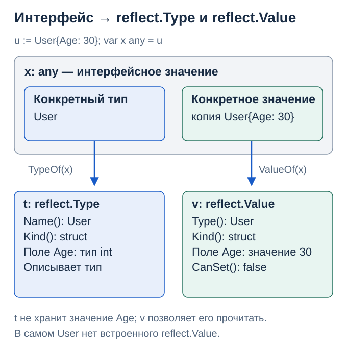
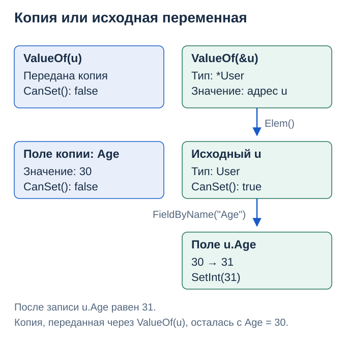
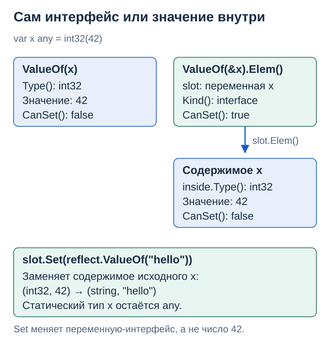

# 8. Reflection: когда тип приходит во время исполнения

Код главы: [reflection.go](../../lessons/reference/reflection/reflection.go) · [example_test.go](../../lessons/reference/reflection/example_test.go).


> Цель главы: Видеть связь интерфейса, reflect.Type и reflect.Value; понимать, когда рефлексия может изменить исходное значение.

## Как интерфейс превращается в объекты reflect

Возьмём структуру и положим её в интерфейс:

```go
type User struct {
    Age int
}

u := User{Age: 30}
var x any = u
t := reflect.TypeOf(x)
v := reflect.ValueOf(x)
```



Верх схемы — логическая модель интерфейса: конкретный тип и значение. Внизу два разных инструмента: t описывает тип User, а v позволяет исследовать переданное значение User{30}. Никакого чтения исходного Go-кода при этом нет: используются сведения о типах, доступные программе во время исполнения.

| Выражение | Что узнаём в этом примере |
|---|---|
| t.Name() | Имя типа: User |
| t.Kind() | Категория: struct |
| t.Field(0).Name | Имя первого поля: Age |
| t.Field(0).Type | Тип первого поля: int |
| v.Field(0).Int() | Значение поля: 30, прочитанное как int64 |
| v.CanSet() | false: через v нельзя заменить значение |

reflect.Type — сам интерфейс API пакета reflect, через который читается описание типа. Его не надо путать с исследуемым any. reflect.Value — структура-обёртка для работы со значением; она также знает его тип. Схемы показывают эти связи, а не точную раскладку служебных полей рантайма или обязательное размещение в куче.

Вызов reflect.ValueOf(u) без явно объявленного x работает так же: параметр ValueOf имеет тип any, поэтому интерфейс появляется на границе вызова. Type — конкретный тип, Kind — его категория; разные определённые типы могут иметь одинаковый Kind.

## Почему ValueOf(u) не позволяет изменить u

```go
u := User{Age: 30}
direct := reflect.ValueOf(u)
field := reflect.ValueOf(&u).Elem().FieldByName("Age")

fmt.Println(direct.CanSet(), field.CanSet()) // false true
field.SetInt(31)
fmt.Println(u.Age) // 31
```



Elem у значения-указателя означает «перейти к тому, на что он указывает» — аналог разыменования *p. Затем FieldByName выбирает поле. Экспортированное Age исходной структуры доступно для записи; поле копии из ValueOf(u) — нет.

Перед Set проверяйте CanSet. Одной адресуемости недостаточно: неэкспортированные поля защищены от такой записи. Возможность изменения зависит и от пути получения reflect.Value.

## Увидеть сам интерфейс или значение внутри него

```go
var x any = int32(42)
value := reflect.ValueOf(x)
slot := reflect.ValueOf(&x).Elem()
inside := slot.Elem()

fmt.Println(value.Kind(), value.CanSet())   // int32 false
fmt.Println(slot.Kind(), slot.CanSet())     // interface true
fmt.Println(inside.Kind(), inside.CanSet()) // int32 false

slot.Set(reflect.ValueOf("hello"))
fmt.Printf("%T %v\n", x, x) // string hello
```



Здесь slot обозначает исходную интерфейсную переменную x. Set заменяет её содержимое, но статический тип x остаётся any. Elem у интерфейсного reflect.Value извлекает текущее конкретное значение; это другой случай применения Elem, чем разыменование указателя.

Если нужен именно интерфейсный тип, используйте reflect.TypeFor[any]() (с Go 1.22) или slot.Type(). TypeOf(x) в этом примере сначала вернёт int32, а после Set — string.

## Обратный путь и nil

```go
v := reflect.ValueOf(User{Age: 30})
back := v.Interface() // статический тип any, динамический User
u, ok := back.(User)
fmt.Println(u.Age, ok) // 30 true
```

Interface возвращает исследуемое значение в интерфейсной форме. Это не преобразование User в другой конкретный тип. Для значений, полученных из неэкспортированных полей, доступ к Interface ограничен; проверяйте CanInterface.

| Вход | TypeOf | ValueOf |
|---|---|---|
| nil-интерфейс | nil | Невалидный Value: IsValid() == false |
| (*User)(nil) | *User | Валидный указатель: Kind() == reflect.Ptr, IsNil() == true |

У невалидного Value нельзя вызывать Type или Interface. IsNil тоже нельзя вызывать произвольно: он применим только к поддерживаемым видам значений. Для динамического входа сначала проверяют IsValid и Kind.

Связь интерфейсов и рефлексии: [The Laws of Reflection](https://go.dev/blog/laws-of-reflection). Точные условия методов: [документация reflect](https://pkg.go.dev/reflect).

## Динамическая конверсия

Когда целевой тип приходит во время выполнения, обычная запись T(x) не подходит. Проверим динамическую конверсию и отдельно выясним, почему совместимости типов иногда недостаточно.

```go
// import "reflect"
func convertDynamic(x any, target reflect.Type) (any, bool) {
    value := reflect.ValueOf(x)
    if target == nil || !value.IsValid() || !value.CanConvert(target) {
        return nil, false
    }
    return value.Convert(target).Interface(), true
}

// out, ok := convertDynamic(int32(42), reflect.TypeOf(int64(0)))
// out имеет статический тип any и динамический тип int64.
```

`reflect.Type.ConvertibleTo` проверяет совместимость типов. `Value.CanConvert` учитывает также конкретное значение: например, длину среза перед конверсией в массив. `Convert` без проверки может вызвать panic.

`AssignableTo` относится к присваиванию, `Implements` — к реализации интерфейса. Эти проверки не взаимозаменяемы. `reflect.Value.Int()` читает целочисленное значение как `int64`, но не меняет исходный тип. Запись через `Set`/`SetInt` дополнительно зависит от доступности значения для изменения.

С Go 1.22 `reflect.TypeFor[T]()` возвращает тип аргумента, включая интерфейсный тип; `reflect.TypeOf(x)` возвращает динамический тип значения. Источники: [reflect](https://pkg.go.dev/reflect), [Go 1.22](https://go.dev/doc/go1.22#reflect).

## Самопроверка

1. Что содержит TypeOf(x): описание интерфейса any или конкретного User? В первом примере — User.
2. Почему для изменения u.Age нужен путь через &u и Elem? Так мы получаем доступ к исходной структуре.
3. Чем slot.Set отличается от inside.SetInt? Первый заменяет содержимое интерфейсной переменной; второй в показанном примере запрещён, потому что inside.CanSet() == false.
4. Почему ConvertibleTo недостаточно для проверки конкретного среза перед конверсией в массив? Нужно учитывать его длину; для этого есть Value.CanConvert.

---

[← Интерфейсы: исходная модель полиморфизма](07-interfaces.md) · [Оглавление](../README.md) · [Алиасы: Go 1.9 →](09-aliases.md)
