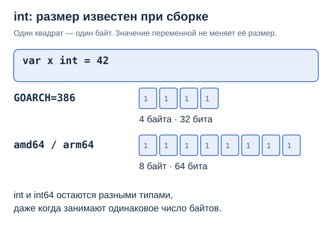
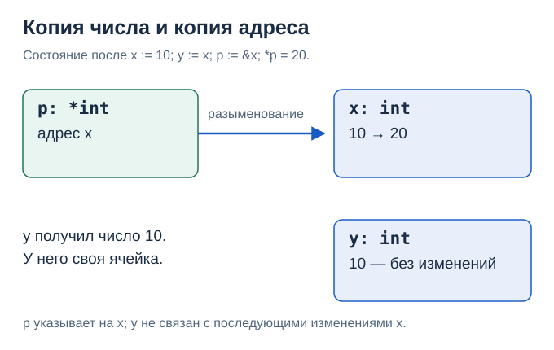
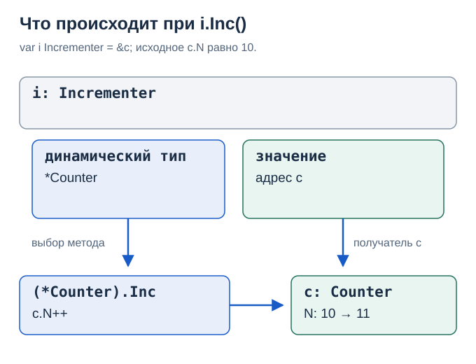
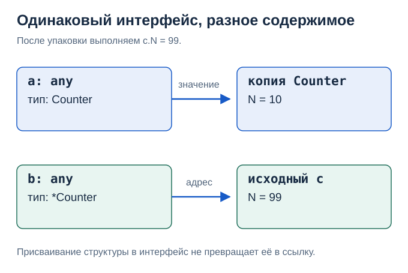
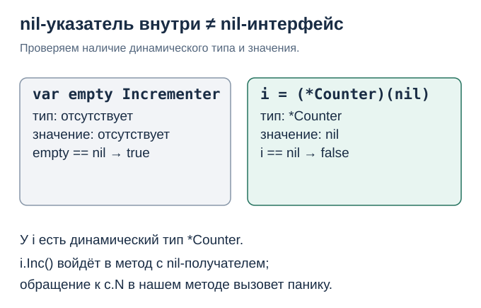

# 20. Go глазами C++: int, указатели и интерфейсы в памяти

Код главы: [example_test.go](../../lessons/reference/cppmemory/example_test.go).

> Цель главы: Видеть, что хранится в переменной, что копируется и к какому объекту обращается метод.

Если вы пишете на C++, адреса и виртуальные вызовы вам знакомы. В Go непривычны конкретные правила: платформенный int, время жизни локальных переменных, неявная реализация интерфейсов и разные наборы методов у T и *T. Разберём их через память. Схемы показывают семантику; расположение объектов на рисунке не означает обязательную аллокацию в куче.

## 1. У int есть размер

В C++ размер int тоже зависит от реализации. В Go int — знаковое целое на 32 или 64 бита; размер известен при компиляции для целевой платформы и не меняется при исполнении. На amd64 и arm64 он занимает 8 байт, на 386 — 4 байта. Значение 42 не заставляет переменную занимать меньше памяти.



| Go | Сопоставление с C++ | Когда использовать |
|---|---|---|
| int32 | int32_t | Нужны ровно 32 бита |
| int64 | int64_t | Нужны ровно 64 бита |
| uint8, он же byte | uint8_t | Байты |
| int | Платформенный знаковый целочисленный тип | Индексы, длины, обычные счётчики |

len возвращает int. Для двоичного протокола выбирайте явную разрядность и порядок байтов; размер структуры в памяти сам по себе не задаёт формат сериализации.

Даже когда размеры совпадают, int и int64 — разные типы. Неявного преобразования между переменными этих типов нет.

```go
var a int = 10
// var b int64 = a // ошибка компиляции
var b int64 = int64(a)
_ = b
```

Отдельная особенность — нетипизированные константы. У константы ниже ещё нет конкретного числового типа; контекст выбирает его и проверяет представимость значения. Это не переменная с меняющимся размером.

```go
const n = 42
var a int32 = n
var b int64 = n
x := n // тип по умолчанию для этой целочисленной константы: int
_, _, _ = a, b, x
```

Подробнее: [числовые типы](https://go.dev/ref/spec#Numeric_types), [константы](https://go.dev/ref/spec#Constants), [числовые конверсии](03-numeric.md).

## 2. Значение копируется; указатель хранит адрес

```go
x := 10
y := x
p := &x
*p = 20
// x == 20, y == 10; p по-прежнему указывает на x
```



| C++ | Go |
|---|---|
| int* p = &x; | p := &x |
| *p = 20; | *p = 20 |
| nullptr | nil |
| p->field | p.field |

Аргументы в Go передаются по значению. Для *T это копия адреса: через неё можно менять исходный объект. Присваивание самому параметру нового адреса не перепривяжет указатель вызывающего. Арифметики указателей в обычном Go нет; C++-ссылок вида T& тоже нет.

Время жизни отличается от C++:

```go
func makeNumber() *int {
    x := 42
    return &x // корректно: объект может пережить вызов функции
}
```

Компилятор и сборщик мусора обеспечивают время жизни объекта, пока тот доступен программе. Escape analysis помогает определить размещение: если нужно, значение попадёт в кучу. Само выражение &x не означает обязательного размещения в куче; оптимизация и встраивание могут менять результат. Аналогичный возврат адреса локального int в C++ оставляет висячий указатель.

Источники: [указатели](https://go.dev/ref/spec#Pointer_types), [Go FAQ: стек и куча](https://go.dev/doc/faq#stack_or_heap).

## 3. Интерфейс связывает конкретный тип и значение

```go
type Counter struct { N int }

func (c *Counter) Inc() { c.N++ }

type Incrementer interface { Inc() }
```

*Counter реализует Incrementer автоматически: его набор методов содержит Inc с нужной сигнатурой. Не нужны ни наследование, ни implements, ни пометка virtual.

```go
c := Counter{N: 10}
var i Incrementer = &c
i.Inc()
// c.N == 11
```



У i статический тип Incrementer: через него доступны обещанные интерфейсом методы, но не поле N. Динамический тип здесь *Counter, динамическое значение — указатель &c. При вызове выбирается соответствующий метод конкретного типа.

Для сопоставления с привычной реализацией C++: виртуальный вызов обычно использует vptr внутри объекта. В стандартной реализации Go непустой интерфейс обычно представлен двумя машинными словами: указателем на таблицу информации о типе и методах и словом данных. В самом Counter встроенного vptr для реализации интерфейса нет. Это деталь реализации, а не гарантия раскладки из спецификации; компилятор также может устранить косвенный вызов.

Для предсказания поведения достаточно модели «динамический тип + значение». Не следует считать, что произвольная структура целиком помещается в одно слово данных или что присваивание интерфейсу всегда выделяет память в куче.

## 4. Методы T и *T: где заканчивается автоматическое взятие адреса

```go
c := Counter{}
c.Inc() // сокращение для (&c).Inc(): c — адресуемая переменная

var i Incrementer = &c // подходит *Counter
// var j Incrementer = c // ошибка: Counter не реализует Incrementer
_ = i
```

| Объявление метода | В наборе методов T | В наборе методов *T |
|---|---|---|
| func (c T) Read() | Да | Да |
| func (c *T) Inc() | Нет | Да |

Автоматическое взятие адреса при вызове не меняет набор методов типа и не применяется при упаковке в интерфейс. Получатель c T — копия значения; c *T — копия указателя. Изменения обычных полей копии структуры не меняют оригинал. Но копирование неглубокое: поля-указатели и срезы могут сохранять доступ к общим данным.

Источники: [наборы методов](https://go.dev/ref/spec#Method_sets), [вызовы методов](https://go.dev/ref/spec#Calls).

## 5. В интерфейсе может быть копия структуры или указатель

any — алиас interface{}, интерфейса без требований к методам. Он появился под этим именем в Go 1.18. В следующих примерах a и b — два интерфейса, но содержимое у них разное.

```go
c := Counter{N: 10}
var a any = c
var b any = &c
c.N = 99
// a.(Counter).N == 10
// b.(*Counter).N == 99
```



Запись a.(Counter) — type assertion: проверка динамического типа и извлечение значения, а не числовая конверсия. При неверном типе эта форма паникует; форма v, ok := a.(Counter) позволяет проверить совпадение без паники. Подробнее: [интерфейсы и assertions](07-interfaces.md).

## 6. Почему интерфейс с nil-указателем не равен nil

```go
var p *Counter = nil
var i Incrementer = p
var empty Incrementer
// p == nil: true
// i == nil: false
// empty == nil: true
```



Интерфейс равен nil, только когда у него отсутствуют и динамический тип, и значение. У i тип есть. Вызов i.Inc() войдёт в метод с c == nil; наш метод запаникует при обращении к c.N. Метод с указателем-получателем мог бы сам обработать nil до разыменования.

Та же ловушка возникает с error: возврат типизированного nil-указателя как error даёт непустой интерфейс. Если ошибки нет, возвращайте nil явно. Источник: [Go FAQ: nil error](https://go.dev/doc/faq#nil_error).

## Самопроверка

1. На amd64 int и int64 занимают по 8 байт. Можно ли присвоить переменную одного типа другой без конверсии? Нет: это разные типы.
2. После y := x и p := &x изменение *p затронет y? Нет: y содержит отдельную копию числа.
3. Почему c.Inc() компилируется, а var i Incrementer = c — нет? Сокращение вызова у адресуемой переменной не добавляет метод в набор Counter.
4. Если c.N изменился после var a any = c, изменится ли значение внутри a? Нет: была скопирована структура.
5. Почему var i Incrementer = (*Counter)(nil) не даёт nil-интерфейс? Динамический тип *Counter присутствует.

```sh
go test ./lessons/reference/cppmemory -v
```

---

[← Зачем вводили новшества](19-motivations.md) · [Оглавление](../README.md) · [Статическая и динамическая типизация →](21-static-dynamic.md)
