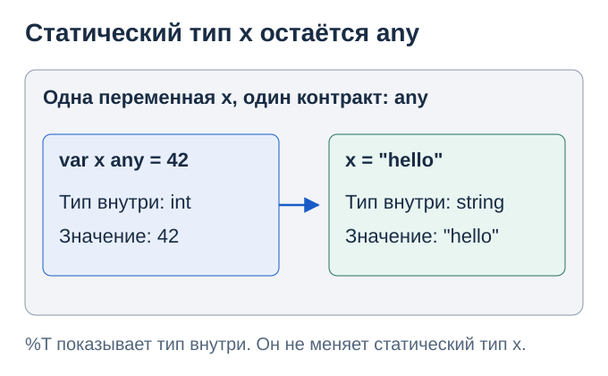

# 21. Статическая и динамическая типизация

Код главы: [example_test.go](../../lessons/reference/typing/example_test.go).

> Цель главы: Различать тип выражения, тип значения внутри интерфейса и момент проверки операции.

Go и C++ — статически типизированные языки. При этом оба умеют выбирать реализацию метода во время исполнения. В Go у интерфейсного значения есть динамический тип. Противоречия нет: «типизация языка» и «динамический тип конкретного значения» описывают разные вещи.

## 1. Что проверяется до запуска

При статической типизации компилятор проверяет допустимость операций по типам выражений. Чтобы отклонить следующий код, ему не нужно запускать программу и узнавать содержимое x.

```go
x := 42
// x = "hello" // ошибка компиляции: x имеет тип int
// x.Read()    // ошибка компиляции: у int нет метода Read
_ = x
```

В C++ аналогичная идея действует для auto x = 42: auto просит вывести тип при компиляции. Он не делает переменную способной менять тип. Go-запись x := 42 тоже фиксирует int. При повторном присваивании меняется значение, а не тип переменной.

Статический тип относится не только к переменным. Например, тип выражения len(s) — int, даже если длина s станет известна лишь во время исполнения.

## 2. Что означает динамическая типизация

В динамически типизированном языке допустимость многих операций определяется по значениям во время исполнения. Значения по-прежнему имеют типы; имя переменной может последовательно обозначать значения разных типов.

Пример на JavaScript:

```javascript
let x = 42;
x = "hello";   // допустимое присваивание
x.toFixed(2);  // TypeError при выполнении: у строки нет такого метода
```

Парсер может успешно разобрать программу, но это не доказывает допустимость всех её операций. Необязательный статический анализатор может заранее обнаружить проблему; это отдельная проверка поверх правил исполнения JavaScript.

| Вопрос | Статическая типизация: Go, C++ | Динамическая типизация: JavaScript |
|---|---|---|
| Откуда известно, какие операции разрешены? | Из статических типов выражений | Во многих случаях из значений во время исполнения |
| Можно ли обнаружить несовместимое присваивание до запуска? | Да: например, строку нельзя присвоить int | Привязка того же имени к строке после числа обычно допустима |
| Нужно ли явно писать тип в каждом объявлении? | Нет: есть вывод типов | Обычно нет |
| Могут ли быть ошибки во время исполнения? | Да | Да |
| Может ли реализация использовать компиляцию или JIT? | Да | Да |

Компиляция и интерпретация — способы исполнения. Они не определяют сами по себе, статическая у языка типизация или динамическая.

## 3. Почему any не превращает Go в динамический язык

any — алиас interface{}, а не отсутствие типа. У переменной x ниже статический тип any на протяжении всего примера. Меняются конкретные значения и их динамические типы внутри интерфейса.

```go
var x any = 42
fmt.Printf("%T\n", x) // int

x = "hello"
fmt.Printf("%T\n", x) // string

// _ = x + 1 // ошибка компиляции даже сразу после x = 42
```



Операция x + 1 запрещена, потому что any не обещает возможность сложения. Компилятор не разрешает её только на основании того, что в предыдущей строке в x положили число. Чтобы работать с числом, сначала явно проверяют динамический тип.

```go
var x any = 42
if n, ok := x.(int); ok {
    fmt.Println(n + 1) // 43: статический тип n — int
}

x = "hello"
n, ok := x.(int)
fmt.Println(n, ok) // 0 false: внутри уже string
```

Статически проверяется допустимость самого assertion и операций с n. При исполнении проверяется, совпадает ли текущий динамический тип с int. Форма x.(int) без ok при несовпадении вызвала бы panic.

Формат %T показывает динамический конкретный тип аргумента, переданного через интерфейс в fmt. По выводу int или string нельзя заключить, что статический тип переменной x изменился. Источники: [переменные](https://go.dev/ref/spec#Variables), [type assertions](https://go.dev/ref/spec#Type_assertions).

## 4. Динамический вызов в статически типизированном языке

Для программиста C++ ближайшая аналогия — ссылка или указатель на базовый класс с виртуальным методом. Статический тип задаёт доступное API, а динамический тип объекта участвует в выборе реализации. Конкретные правила Go и его представление в памяти отличаются: наследование для реализации интерфейса не требуется.

```go
type Speaker interface {
    Speak() string
}

type Cat struct{}
func (Cat) Speak() string { return "meow" }

type Robot struct{}
func (Robot) Speak() string { return "beep" }

func say(s Speaker) {
    fmt.Println(s.Speak())
}
```

При компиляции say проверяется по контракту Speaker: метод Speak существует и возвращает string. Функции не нужно знать конкретный тип каждого будущего аргумента.

```go
var s Speaker = Cat{}
say(s) // meow

s = Robot{}
say(s) // beep

// s = 42 // ошибка компиляции: int не реализует Speaker
```

| Уровень | Что известно в примере |
|---|---|
| Статический тип s | Speaker, в обоих вызовах |
| Динамический тип значения | Сначала Cat, затем Robot |
| Доступное через s API | Метод Speak() string |
| Выбранная реализация | Cat.Speak или Robot.Speak |

Это динамическая диспетчеризация в статически типизированном языке. Компилятор может оптимизировать конкретный вызов до прямого, если докажет тип; смысл программы от этого не меняется.

## 5. Неявная реализация интерфейса — не динамический duck typing

Go не требует писать implements Speaker. Наличие подходящего набора методов достаточно, но соответствие при присваивании конкретного типа интерфейсу проверяется компилятором. Достаточно точной сигнатуры метода, а не только совпадения его имени.

При динамическом duck typing код обычно пытается выполнить операцию над текущим объектом, а наличие нужного поведения выясняется во время исполнения. В Go функция say получает заранее проверенный контракт Speaker.

Assertion из any в Speaker переносит конкретную проверку на исполнение, но делает это явно:

```go
var x any = Robot{}
s, ok := x.(Speaker)
if ok {
    fmt.Println(s.Speak()) // beep
}

x = 42
_, ok = x.(Speaker)
fmt.Println(ok) // false
```

Для assertion к интерфейсу проверяется, реализует ли динамический тип этот интерфейс. Для assertion к конкретному типу проверяется совпадение конкретного типа. Подробнее: [интерфейсы](07-interfaces.md) и [наборы методов](https://go.dev/ref/spec#Method_sets).

## 6. Какие понятия не стоит смешивать

| Понятие | На какой вопрос отвечает | Пример в Go |
|---|---|---|
| Статическая типизация | Можно ли проверить операцию по типам выражений до исполнения? | x + 1 запрещено для x типа any |
| Вывод типов | Можно ли определить тип без явной аннотации? | x := 42 получает int |
| Динамический тип | Какой конкретный тип у значения внутри интерфейса сейчас? | В any хранится Robot |
| Динамическая диспетчеризация | Какая реализация метода будет вызвана? | Cat.Speak или Robot.Speak |
| Явная проверка типа во время исполнения | Подходит ли текущее содержимое интерфейса? | s, ok := x.(Speaker) |
| Правила неявных преобразований | Какие переходы типов язык выполняет сам? | int и int64 требуют явной конверсии между переменными |

Термины «сильная» и «слабая» типизация часто используют для обсуждения неявных преобразований и строгости отдельных проверок; единого критерия для этих ярлыков нет. Лучше назвать конкретное правило. Отсутствие автоматической конверсии int в int64 не является определением статической типизации: C++ допускает многие неявные числовые преобразования и тоже статически типизирован.

Статическая типизация также не гарантирует отсутствие runtime-ошибок: возможны выход за границу среза, разыменование nil и неуспешный assertion без ok. Generics не меняют классификацию Go: тело функции с параметром типа проверяется с учётом операций, разрешённых ограничением.

## Самопроверка

1. Если x := 42, можно ли затем присвоить x строку? Нет: тип x — int.
2. Если var x any = 42, почему разрешено x = "hello"? Тип переменной остаётся any; оба конкретных типа подходят пустому интерфейсу.
3. Почему x + 1 не работает для any с числом внутри? Статический тип any не разрешает сложение.
4. Если %T напечатал Robot, какой статический тип у исходной переменной? Одного вывода недостаточно: переменная могла иметь тип Robot, Speaker или any.
5. Делает ли выбор Cat.Speak или Robot.Speak во время исполнения язык динамически типизированным? Нет: доступный метод уже проверен по Speaker.

```sh
go test ./lessons/reference/typing -v
```

---

[← Go глазами C++: память и интерфейсы](20-cpp-memory.md) · [Оглавление](../README.md)
